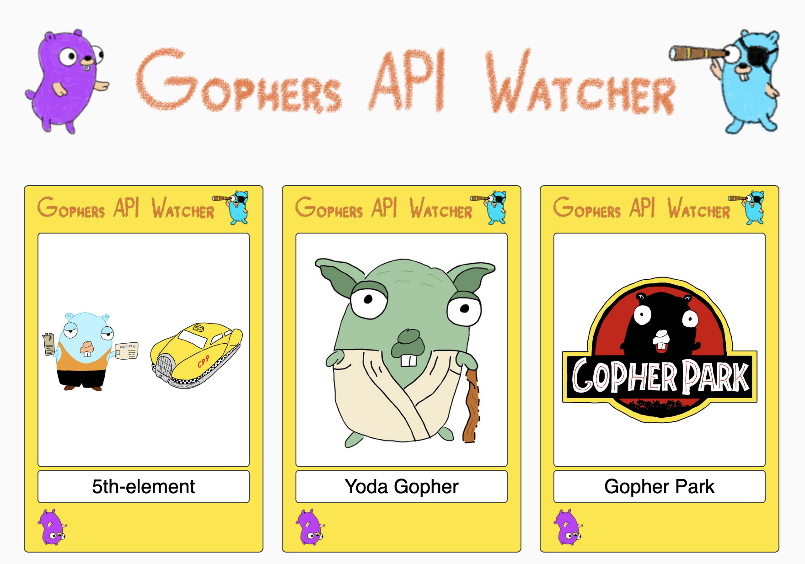

# Gophers API Watcher

A frontend for [Gopher API](https://github.com/scraly/gophers-api).



This webcomponent follows the [open-wc](https://github.com/open-wc/open-wc) recommendation.


## Gitpod integration

[](https://gitpod.io/#https://github.com/lostinbrittany/gophers-api-watcher.git)

## Development

Install pre-requisites

```
npm install -g webpack-dev-server
npm install webpack-dev-server --save-dev
```

Run locally

```
npm run start
```

## Installation

```bash
npm i gophers-api-watcher
```

## Usage

```html
<script type="module">
  import 'gophers-api-watcher/gophers-api-watcher.js';
</script>

<gophers-api-watcher></gophers-api-watcher>
```


## Tooling configs

For most of the tools, the configuration is in the `package.json` to minimize the amount of files in your project.

If you customize the configuration a lot, you can consider moving them to individual files.

## Local Demo with `web-dev-server`

```bash
npm start
```

To run a local development server that serves the basic demo located in `demo/index.html`
